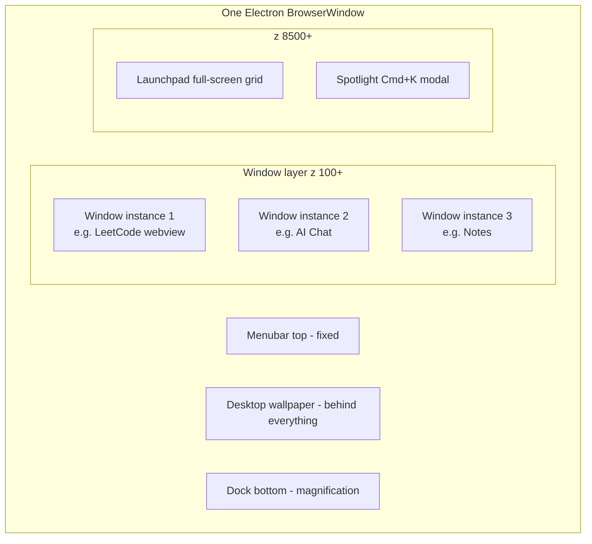
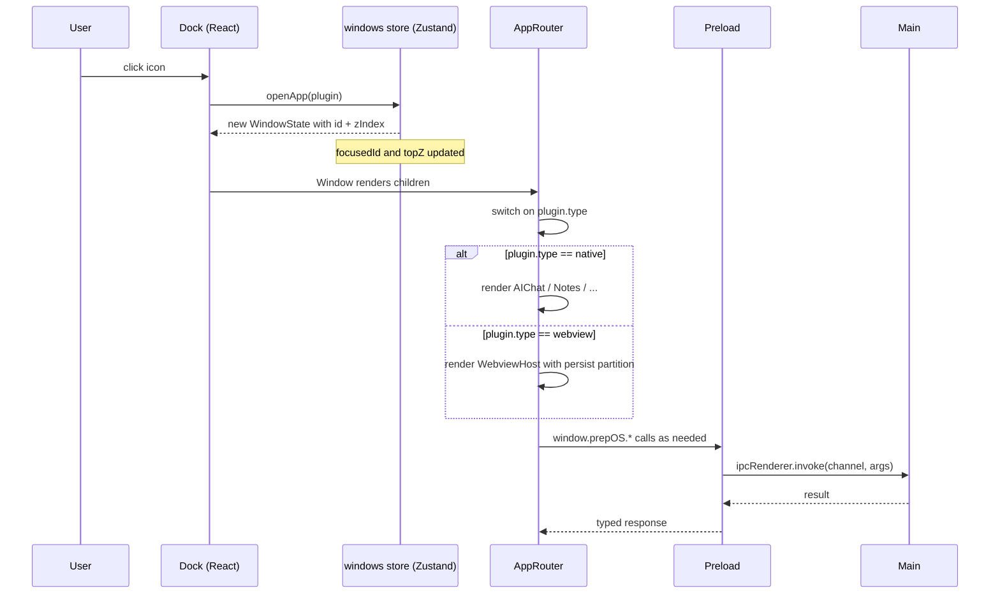
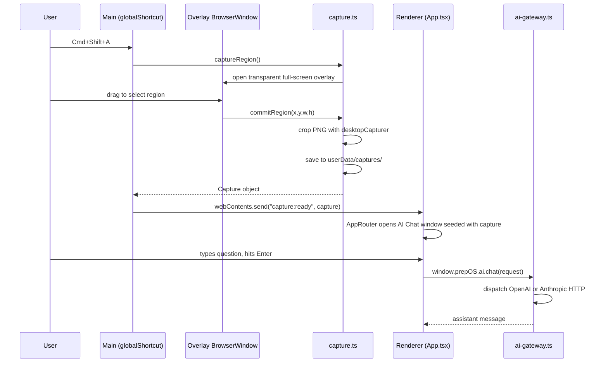

# Architecture

PrepOS runs as a single Electron `BrowserWindow` on the user's desktop. Inside that window, a React app paints a full-screen "mini macOS" — dock, menubar, draggable windows, launchpad, spotlight. Each "app" in the dock is rendered either by a native React component (AI Chat, Notes, Playground, Settings) or by an embedded `<webview>` pointing at any URL (LeetCode, HackerRank, etc.).

## Process model

Electron has two runtime layers. PrepOS follows the standard split:

```mermaid
flowchart LR
    subgraph Main [Main process - Node]
        Entry[index.ts<br/>BrowserWindow + shortcuts + tray]
        IPC[ipc.ts<br/>ipcMain handlers]
        Cap[capture.ts<br/>desktopCapturer + overlay]
        AI[ai-gateway.ts<br/>OpenAI / Anthropic HTTP]
        Plug[plugins.ts<br/>registry]
        Store[store.ts<br/>electron-store + safeStorage]
    end
    Preload[preload.ts<br/>contextBridge]
    subgraph Renderer [Renderer - Chromium sandbox]
        App[App.tsx]
        Shell[Desktop / Menubar / Dock / Launchpad / Spotlight]
        Win[Window manager Zustand]
        Apps[App components<br/>AIChat / Notes / Playground / Settings / WebviewHost]
    end

    Entry --> Preload
    IPC -.exposes.-> Preload
    Preload -.contextBridge.-> App
    App --> Shell
    App --> Win
    Win --> Apps
    Apps -.window.prepOS.*.-> Preload
    IPC --> Cap
    IPC --> AI
    IPC --> Plug
    IPC --> Store
```

Key rule: the renderer can **only** talk to the main process through methods exposed in `preload.ts`. Those methods are listed in [ipc-reference.md](ipc-reference.md).

## Build-time layout

`electron-vite` produces three independent bundles:

| Source                             | Output                                | Runtime                            |
| ---------------------------------- | ------------------------------------- | ---------------------------------- |
| `src/main/index.ts` + imports      | `out/main/index.js` (CJS)             | Node, inside Electron              |
| `src/main/preload.ts`              | `out/preload/preload.js` (CJS)        | Isolated world, between Node + DOM |
| `src/renderer/index.html` + `.tsx` | `out/renderer/` (ESM chunks + assets) | Chromium                           |

`electron.vite.config.ts` wires aliases (`@main`, `@shared`, `@renderer`) and sets rollup inputs for each.

## Runtime layout inside the window



CSS z-indexes (in [`styles.css`](../src/renderer/src/styles.css) and component styles):

- Desktop: default stacking context
- Menubar: `9200`
- Dock: `9000`
- Launchpad: `8500`
- Spotlight: `9500`
- Windows: dynamic starting at `10+` via Zustand `topZ`

## Data flow: opening an app from the dock



## Data flow: the signature capture → AI feature

See [capture-and-ai.md](capture-and-ai.md) for the detailed walkthrough. High-level:



## State management philosophy

Zero global Redux / context-heavy patterns. We use **three small Zustand stores**, each owning one concern:

- `windows` — open windows, focus, z-order, position, size, minimize/maximize, per-window app state
- `plugins` — installed plugin manifests (built-in + user-added); refreshed from main on startup
- `shell` — transient UI toggles (launchpad open, spotlight open)

Persistence lives in main (`electron-store`), not in the stores. When renderer needs something persisted (chat sessions, notes, captures, user plugins, API keys, settings, focus sessions), it calls `window.prepOS.*` which proxies to main.

## Persistent storage

All user data is kept on-device. There is no server, no cloud, no telemetry.

| Data                                                                                  | Location                                                                 | Mechanism                       |
| ------------------------------------------------------------------------------------- | ------------------------------------------------------------------------ | ------------------------------- |
| Settings, API keys, notes, chat sessions, user plugins, capture index, focus sessions | `<userData>/prep-os.json`                                                | `electron-store` (JSON on disk) |
| API keys within that JSON                                                             | Encrypted via `safeStorage` (macOS Keychain / Windows DPAPI / libsecret) | `src/main/store.ts`             |
| Capture PNG files                                                                     | `<userData>/captures/<ts>-<id>.png`                                      | Raw files                       |
| Webview cookies / localStorage per plugin                                             | Electron partitions `persist:<plugin-id>`                                | Chromium default                |
| Focus session history (capped at 1000)                                                | `focusSessions[]` key in `prep-os.json`                                  | `electron-store`                |

`<userData>` resolves to `~/Library/Application Support/PrepOS` on macOS, `%APPDATA%\PrepOS\` on Windows, `~/.config/PrepOS/` on Linux.

## Security posture

- `contextIsolation: true` — preload runs in isolated world, cannot touch `window`.
- `nodeIntegration: false` — no `require()` in renderer.
- `webviewTag: true` — required for embedded third-party sites; each `<webview>` uses a distinct `persist:<id>` partition for cookie isolation.
- CSP declared in `src/renderer/index.html` restricts `connect-src` to `api.openai.com`, `api.anthropic.com`, `self` and `cdn.jsdelivr.net` (Monaco loads workers from there in dev).
- External links (http/https in `target=_blank` popups) are routed to the system browser via `shell.openExternal`.

See [troubleshooting.md#security-warnings](troubleshooting.md) for how to tighten further.

## What's intentionally NOT here

- **No SQLite / better-sqlite3.** `electron-store` is enough for our current data volume. Swap in SQLite only if notes cross thousands of entries.
- **No Redux / Jotai.** Zustand is small and fits.
- **No CSS-in-JS.** Tailwind utilities + a handful of CSS tokens in `styles.css`.
- **No test runner yet.** Add Vitest + Playwright as a follow-up phase.
