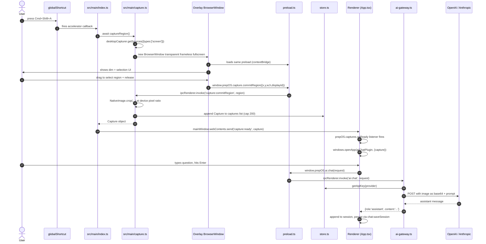

# Capture → AI

The flagship feature. End-to-end flow of: user presses `Cmd+Shift+A`, drags a region, the screenshot lands inside an AI Chat window, they type a question, the AI responds.

## Full sequence



Steps correspond to the files you'd touch to modify each stage.

## Triggering the overlay

Three ways to trigger the capture, all ending in `captureRegion()`:

1. **Global shortcut** — `Cmd+Shift+A`, registered in [`src/main/index.ts#registerShortcuts`](../src/main/index.ts). Works even when the app is unfocused. On first use, macOS prompts for Screen Recording permission.
2. **Menubar button** — "Capture" in [`Menubar.tsx`](../src/renderer/src/components/Menubar.tsx) calls `window.prepOS.capture.trigger()`.
3. **Tray menu** — the tray item "Capture region" in [`src/main/index.ts#createTray`](../src/main/index.ts) calls the same `captureRegion()`.

## Overlay UX

The overlay is a **separate transparent BrowserWindow** (not a React component inside the main window) because we need to cover all displays, including areas outside our main window, and we can't trust CSS fullscreen to cover the notch / menu bar on macOS.

Implementation details in [`src/main/capture.ts`](../src/main/capture.ts):

- `transparent: true, frame: false, fullscreen: true, alwaysOnTop: true, skipTaskbar: true, resizable: false`.
- Content is a single `data:text/html` URL containing:
  - an `` rendering the pre-fetched `desktopCapturer` source PNG (the exact current screen pixels)
  - a dimming layer on top at `rgba(0,0,0,0.35)`
  - a selection `<div>` with a soft border + readout showing live dimensions
  - keyboard listeners: `Escape` → `window.prepOS.capture.cancelRegion()`; `Enter` if a region is selected → commit current region
  - mouse listeners: track down/move/up to update the selection rect.
- On commit, the overlay sends the selection in **CSS pixels relative to the display**. Main multiplies by `scaleFactor` from `screen.getDisplayMatching(...)` before cropping so we keep full resolution.

## Saving a capture

`commitCaptureRegion` in main:

1. Re-fetches the source via `desktopCapturer` at the same thumbnail size.
2. Calls `source.thumbnail.crop({ x, y, width, height })` — `NativeImage.crop` expects device pixels, which is why we scale.
3. Writes `PNG` buffer to `<userData>/captures/<timestamp>-<nanoid6>.png`.
4. Builds a `Capture` object:

   ```ts
   {
     id: 'cap_...',
     createdAt: 1730000000000,
     filePath: '/Users/.../PrepOS/captures/1730000000000-ab12cd.png',
     width, height,
     displayId: number
   }
   ```

5. Appends to `store.captures` and trims to the most recent 200.
6. Returns the `Capture`.

`src/main/index.ts` then does `mainWindow.webContents.send('capture:ready', capture)`. The overlay window self-closes.

## Receiving the capture in React

`App.tsx` subscribes on mount:

```tsx
useEffect(() => {
  const off = window.prepOS.captures.onReady((cap) => {
    const aiChat = plugins.list.find((p) => p.id === "ai-chat");
    if (!aiChat) return;
    windows.openApp(aiChat, { capture: cap });
  });
  return off;
}, [plugins.list]);
```

`windows.openApp` with a second `appState` arg seeds the window's initial state. `AppRouter` for `ai-chat` passes `state?.capture` into `<AIChat initialCapture={...} />`.

Inside `AIChat.tsx`:

- If `initialCapture` is present and no message yet, prepend a "user" message whose content contains a thumbnail image tile + a muted placeholder, and focus the textarea with a hint like "Ask a question about this screenshot…".
- When the user sends, the `ChatMessage` sent to main includes `images: [{ kind: 'capture', id: capture.id }]`. Main resolves `id → filePath` in `ai-gateway.ts` and reads the PNG bytes.

## Sending an image to the AI

`src/main/ai-gateway.ts` → `extractImageBase64(capture | path)`:

- Reads the PNG file off disk.
- Encodes to base64.
- Returns `{ mediaType: 'image/png', data }`.

`callOpenAI` packs it as:

```json
{
  "role": "user",
  "content": [
    { "type": "text", "text": "<user prompt>" },
    { "type": "image_url", "image_url": { "url": "data:image/png;base64,..." } }
  ]
}
```

`callAnthropic` packs it as:

```json
{
  "role": "user",
  "content": [
    { "type": "text", "text": "<user prompt>" },
    { "type": "image", "source": { "type": "base64", "media_type": "image/png", "data": "..." } }
  ]
}
```

The response is extracted from `choices[0].message.content` (OpenAI) or `content[0].text` (Anthropic) and returned as `{ role: 'assistant', content }`.

## Persistence

Chat sessions are saved via `window.prepOS.chat.saveSession(session)` on every assistant reply + every user send. The `session` contains the list of messages with the **capture id**, not the image bytes, so the JSON store stays small. When a session is re-opened in a new app launch, `AIChat.tsx` resolves each capture id to its thumbnail via `window.prepOS.captures.list()` → `getCapture(id)` (which returns path + buffer).

Captures themselves are trimmed to the last 200 files — on exceed, the oldest is removed from the index; the PNG file is deleted via `fs.unlink`.

## Editing the capture UX

Most UX tweaks land in `capture.ts` because the overlay HTML is built there. Things to keep invariant:

- The overlay preload must stay as the main preload so `window.prepOS.capture.commitRegion` / `cancelRegion` resolve.
- Device-pixel correctness. Always multiply CSS coords by the display's `scaleFactor` before calling `NativeImage.crop`.
- Close the overlay immediately after commit/cancel (memory + GPU pressure).
- Fallback: if `desktopCapturer.getSources` rejects (denied permissions), bubble an error to the renderer so Settings can show "Grant Screen Recording access".

## Edge cases worth knowing

- **Multi-monitor:** the overlay currently spans the display where the mouse is at the time of trigger (Electron opens a fullscreen window on that display). Region is clamped to that display. Supporting a single cross-display rubber band is possible by opening one overlay per display and coordinating — a known future improvement.
- **HiDPI:** on macOS Retina the thumbnail comes in at 2x or 3x. Crop coordinates must be scaled. The overlay already does this by feeding `devicePixelRatio` into the coord math.
- **Tiny selections:** we enforce a min 8x8 px rectangle; below that the overlay cancels silently to avoid empty PNGs.
- **Permissions:** first run, macOS will pop the Screen Recording dialog. Until the user approves, `desktopCapturer.getSources` returns empty sources. `capture.ts` detects this and surfaces an error.
